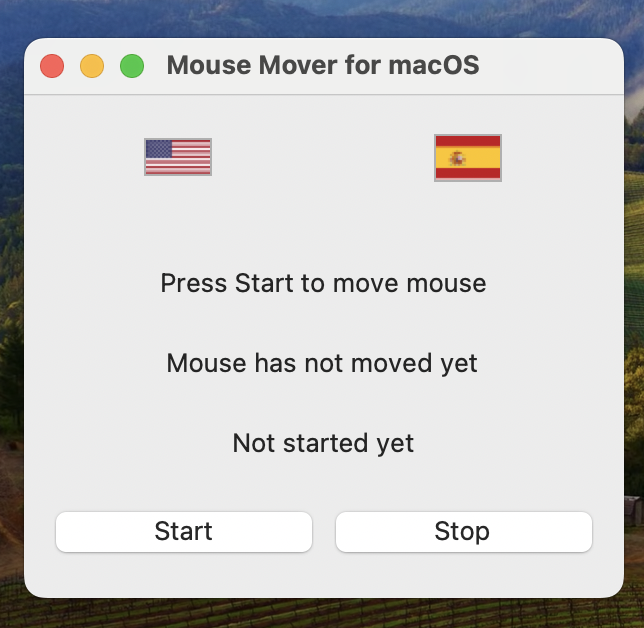

# 🖱️ **Mouse Mover for Windows & macOS**
 
 
 

🎉 **Mouse Mover** is the perfect solution for keeping your computer awake during long tasks, downloads, presentations, or just to prevent your system from going to sleep while you're away. Whether you’re using **macOS** or **Windows**, this simple app will take care of moving the mouse cursor for you, with just a click of a button!

### 🚀 **Why Mouse Mover?**
- **No more interruptions:** Ensure your system doesn’t go idle during long processes.
- **Cross-platform:** Fully functional on both **Windows 11** and **macOS Sonoma**.
- **Easy-to-use:** A minimalistic GUI that lets you start or stop the app with ease.
- **Activity tracker:** Get real-time updates of how many times the mouse has moved and for how long the app has been running.
- **Custom intervals:** The app moves your cursor at regular intervals to mimic activity.
- **Multilingual:** Supports **English** and **Spanish** with flag-based language switching.

## ⚙️ **Tech Stack & Features**
- **Languages:** Python 3.12 🐍
- **GUI Libraries:** Tkinter (macOS) & CustomTkinter for Windows.
- **Cross-Platform:** Works on **macOS** and **Windows 11**.
- **Auto Dependencies:** Automatically handles `caffeinate` installation for macOS if necessary.
- **Lightweight:** Small app size that doesn’t hog system resources.
- **Modern Look:** Sleek interface with platform-specific icons and design aesthetics.

## 🌟 **Features**
### ✨ **Cross-Platform:**
- 🖥️ **macOS**: Uses `Tkinter` and system-friendly `caffeinate` to prevent the system from sleeping.
- 🖼️ **Windows**: Leverages `CustomTkinter` for a modern look and uses `pyautogui` to handle mouse movement.

### 🕹️ **Custom Controls:**
- **Start and Stop Buttons:** Easily control when the mouse should start or stop moving.
- **Interval Timer:** Set intervals to keep your system active without moving the mouse manually.
- **Log Tracking:** Records your mouse movements, useful for tracking and debugging.

### 📊 **Activity Feedback:**
- See how many times the mouse has moved since you started.
- A live timer shows how long the app has been running.

## 📥 **Get Mouse Mover**

👉 **[Download Mouse Mover for macOS & Windows Here](https://github.com/Juandi-M/autoMouseMover/releases)** 👈

🚀 **Installation Instructions:**
1. Download the latest `.zip` file from the [release section](https://github.com/Juandi-M/autoMouseMover/releases).
2. For **macOS**: Unzip the file, **drag the `.app` into your `Applications` folder**.
    - If you encounter a Gatekeeper warning because the app is unsigned, right-click the app and select "Open" from the context menu. Then click "Open" again in the dialog.
3. For **Windows**: Download the `.exe` file (coming soon).
4. Enjoy! 🖱️

Download Link for macOS:
- **[MouseMoverMac.zip](https://github.com/Juandi-M/autoMouseMover/releases/download/v0.5.0-beta/MouseMoverMac.zip)**

## 🖼️ **Screenshots**

<table>
  <tr>
    <td align="center">
      <strong>Mac View</strong>
    </td>
    <td align="center">
      <strong>Windows View</strong>
    </td>
  </tr>
  <tr>
    <td align="center">
      
    </td>
    <td align="center">
      
    </td>
  </tr>
</table>

## 🏷️ **Releases**

Check out our latest release **[here](https://github.com/Juandi-M/autoMouseMover/releases)** and grab your version of **Mouse Mover** for your platform!

- Latest version: **v1.0.0** (Pre-release) 🖥️
- Direct Download: **[MouseMoverMac.zip](https://github.com/Juandi-M/autoMouseMover/releases/download/v0.5.0-beta/MouseMoverMac.zip)**

## 🌟 **Contribute & Give Us a Star!**

If you find this tool useful, **don’t forget to give us a star** ⭐ on GitHub! Help us improve by sharing feedback, suggestions, or contributing to the project.

 

### **Total Downloads:**

 

## 📄 **License**

This project is licensed under the [MIT License](LICENSE).
