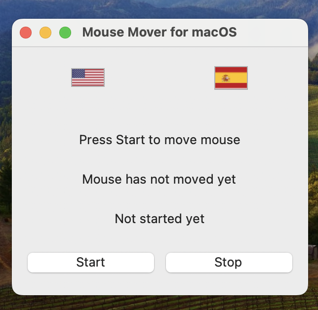

# 🖱️ Mouse Mover for macOS


## Overview

**Mouse Mover for macOS** is a simple yet powerful application designed to keep your macOS system active by simulating mouse movements. This tool is particularly useful for preventing your computer from going to sleep or activating screensavers during presentations or while performing long-running tasks.

## Tech Stack

- **Python 3.11**: The core language used to develop the application.
- **Tkinter**: Utilized for creating the graphical user interface (GUI).
- **Pillow (PIL)**: Used for handling images, specifically the flags for language switching.
- **pyautogui**: Handles the mouse movement simulation.
- **subprocess**: Executes shell commands to install missing dependencies and manage processes like `caffeinate`.
- **logging**: Logs the application's activity, useful for tracking and debugging.
- **requests**: Fetches the flag images from the web.

## Features

- **Multilingual Support**: The application supports both English and Spanish. Users can easily switch between languages using intuitive flag buttons.
- **Responsive GUI**: The application interface is responsive and adapts to different screen sizes, with all buttons and labels centrally aligned.
- **Modern UI**: A clean and modern user interface.
- **Mouse Movement Simulation**: Automatically moves the mouse at regular intervals to prevent the system from going idle.
- **Logging**: All actions and events are logged to a file for tracking and debugging purposes.
- **Auto-Installation of Dependencies**: Automatically checks and installs required dependencies, including the `caffeinate` tool on macOS.
- **Custom Icons**: Includes a custom icon set for the application.

## Project Structure

The project is organized as follows:

```plaintext
mac/
├── README.MD               # Project documentation
├── app/                    # Core application logic
│   ├── gui.py              # GUI-related code
│   ├── lang/               # Language files (English and Spanish)
│   ├── main.py             # Entry point of the application
│   └── utils.py            # Utility functions
├── assets/                 # Static assets like icons and packaging files
│   ├── icons/              # Application icons
│   └── package/            # Files related to packaging the app
├── build/                  # Build artifacts
│   └── MouseMoverApp.spec  # PyInstaller spec file
├── logs/                   # Logs directory
├── requirements.txt        # Python dependencies
└── scripts/                # Setup and installation scripts
    ├── install_caffeinate.sh
    └── postinstall.sh
```

### Key Files
- **`app/main.py`**: The main entry point for the application.
- **`app/gui.py`**: Contains the code for the graphical user interface.
- **`app/utils.py`**: Utility functions used throughout the application, including language loading and logging initialization.
- **`app/lang/`**: Contains the language files (`lang_en.py`, `lang_es.py`).
- **`assets/icons/MouseMoverIcon.icns`**: Custom icon for the application.
- **`build/MouseMoverApp.spec`**: Configuration file for `PyInstaller` to package the application.
- **`scripts/install_caffeinate.sh`**: A shell script to check and install the `caffeinate` tool if it's missing.

## Installation

### Prerequisites

Ensure you have Python 3.11 installed on your macOS system. You can check your Python version by running:

```bash
python3 --version
```

### Clone the Repository

```bash
git clone https://github.com/yourusername/autoMouseMover.git
cd autoMouseMover/mac
```

### Install Required Python Packages

Install the required Python libraries using `pip`:

```bash
pip install -r requirements.txt
```

If you don't have `pip` installed, you can install it by following the instructions [here](https://pip.pypa.io/en/stable/installation/).

## Running the Project Locally

Navigate to the `app` directory and run the `main.py` script:

```bash
cd app
python3 main.py
```

## How It Works

- **Language Switching**: Choose between English and Spanish by clicking the respective flag at the top of the window. The interface will update immediately to reflect your language choice.
  
- **Start and Stop**: Click "Start" to begin simulating mouse movements. The application will log how many times the mouse has moved and display the elapsed time. Click "Stop" to halt the simulation.

- **Auto Installation of `caffeinate`**: If the `caffeinate` command is not found on your system, the application will attempt to install it automatically using Homebrew.

## Packaging the Application

If you want to package the application as a standalone macOS app, you can use PyInstaller with the provided `.spec` file:

```bash
pyinstaller build/MouseMoverApp.spec
```

This will generate a `.app` bundle in the `dist` directory.

## Contributing

If you'd like to contribute to this project, feel free to fork the repository and submit a pull request.

## Screenshots


